# ACT_Chat

A small for FFXIV to make your life easier when having multiple individual /tell conversations at the same time.

## Download
You can download the most recent version of the plugin in the most recently succeeded build. Click the Build button below, select the most recent **green** build, and click the ACT Plugin button on the bottom:
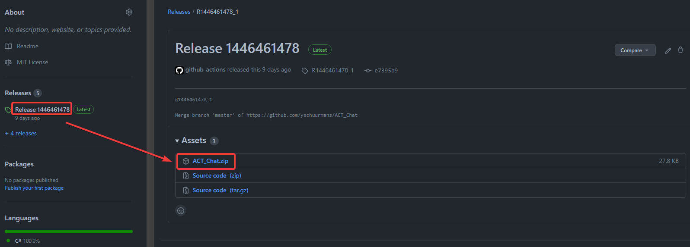

---
## Install Guide
Based on https://github.com/FFXIV-ACT/setup-guide

## Contents
- [Installing ACT](#installing-act)
- [Configuring ACT](#configuring-act)
  - [Running as Admin](#running-as-admin)
  - [Adding Firewall Exception](#adding-firewall-exception)
- [FFXIV ACT Plugin](#ffxiv-act-plugin)
- [OverlayPlugin](#overlayplugin)
- [Adding an Overlay](#adding-an-overlay)
  - [Preset Overlays](#preset-overlays)
  - [Custom Overlays](#custom-overlays)
- [FFLogs Uploader](#fflogs-uploader)
  - [Installing the Uploader](#installing-the-uploader)
  - [Uploading a Log](#uploading-a-log)

## Installing ACT

Navigate to the [ACT website](https://advancedcombattracker.com/), click on the **Download** page tab, then click on the `Advanced Combat Tracker - Setup` link to download the ACT installation program.

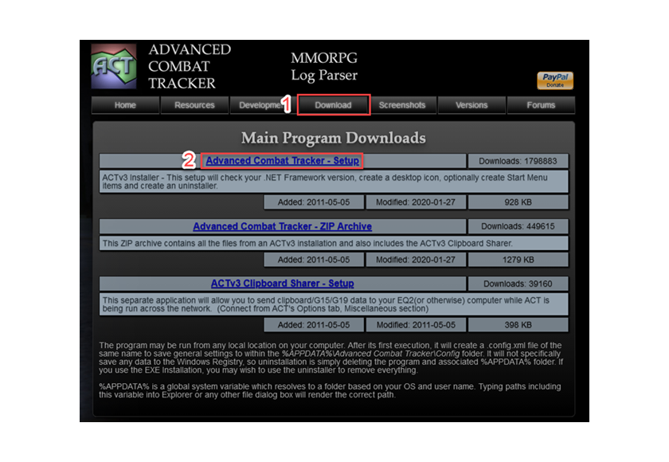

Find the `ACTv3-Setup` executable in your downloads and run it to begin the installation (If you get a User Account Control prompt, click yes).

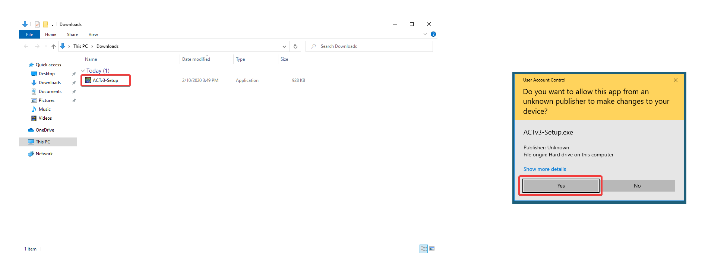

The setup program will ask you for the installation location and start menu folder (You can leave the default options). Click **Install** then **Close** to complete the installation.

## Configuring ACT

### Running as Admin
It is recommended that ACT be run as Admin. You can right click on the ACT shortcut and select the **Run as administrator** option. You may get an UAC prompt, select yes.

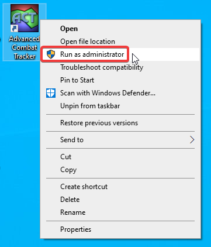

You can also configure ACT to always run as admin by right clicking on the shortcut then selecting **Properties**. In the **Properties** window, select the **Compatibility** tab, then check the **Run this program as an administrator** option. Click **Apply** to save the changes. This will ensure ACT is always run as admin.

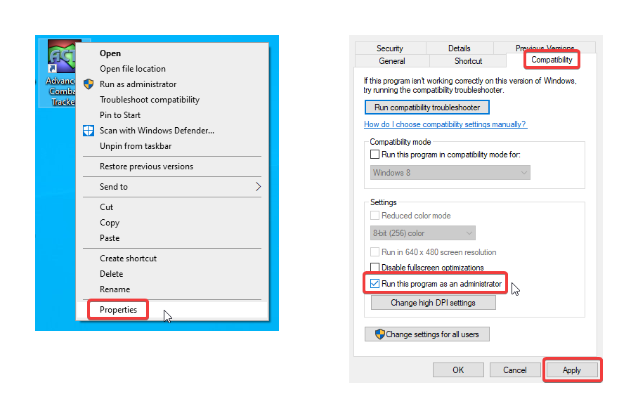

### Adding Firewall Exception
Open the windows **Control Panel** (you can search for control panel in the taskbar search bar). Select the **System and Security** category and under **Windows Defender Firewall** click on **Allow an app through Windows Firewall**. 

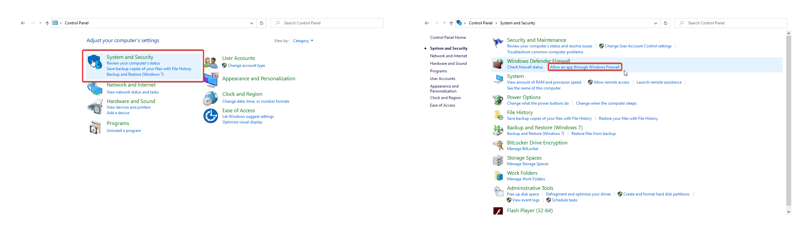

Inside the allowed apps window, click on **Change settings** button, then on the **Allow another app...** button. This will open up a dialog window to select an app.

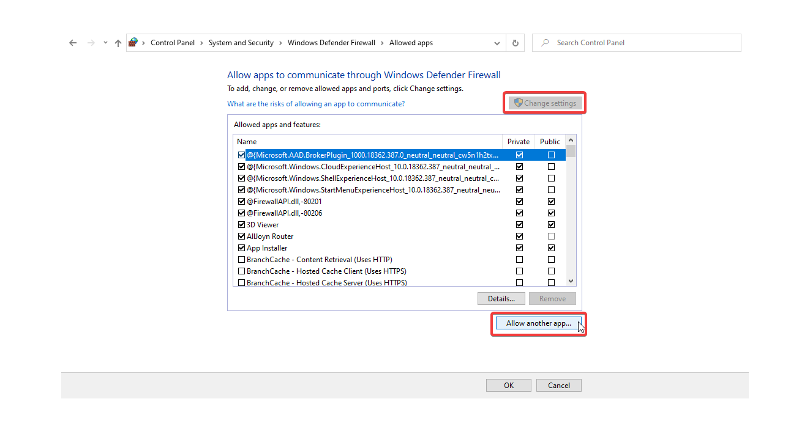

Click on the **Browse...** button and navigate to the ACT install folder. The default location should be in `C:\Program Files (x86)\Advanced Combat Tracker`.

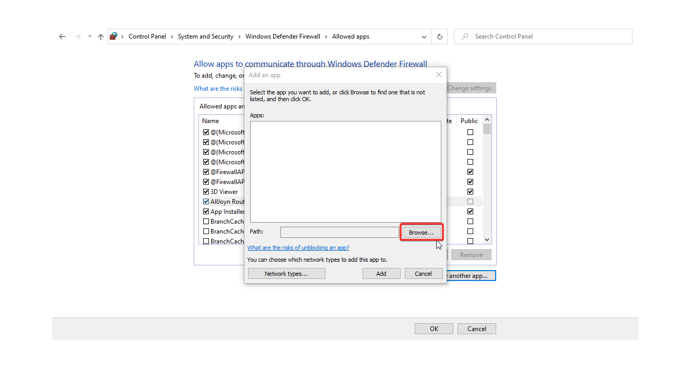

In the ACT folder, select the `Advanced Combat Tracker` application and click on **Open**.

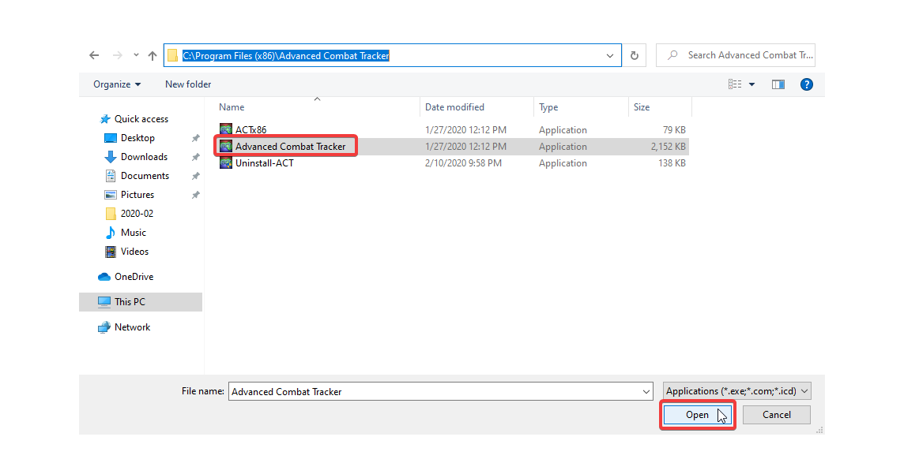

Back in the dialog window, click on **Add** to add ACT to the windows firewall exceptions.

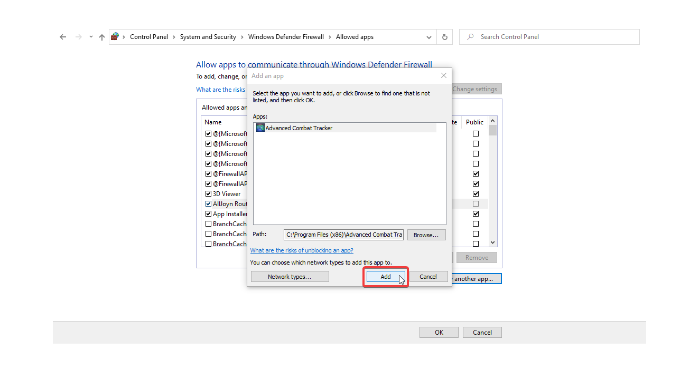

`Advanced Combat Tracker` should now appear in the list of **Allowed apps and features**. Click **OK** and exit the Control Panel.

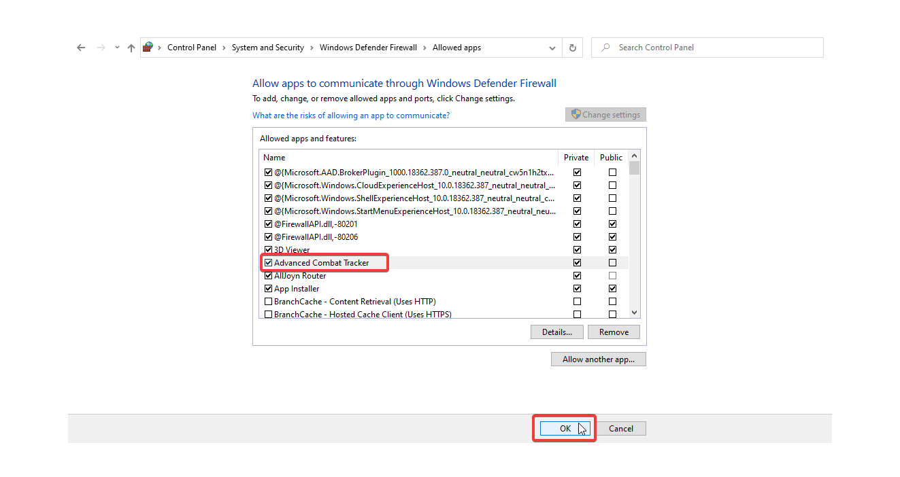

## FFXIV ACT Plugin

Upon first running ACT, it will prompt you with the Startup Wizard. If you forget to download a parsing plugin, ACT will prompt you again the next time you run it, or you can manually open the wizard by going to **Options** > **Miscellaneous** > **Show Startup Wizard**.

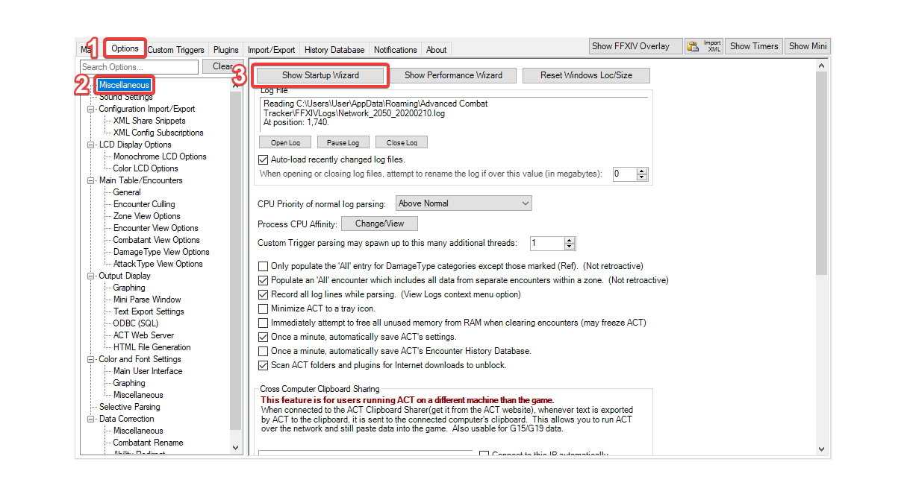

In the **Parsing Plugin** section of the startup wizard, ensure `FFXIV Parsing Plugin` is selected from the dropdown, then click the `Download/Enable Plugin` button. You will receive an alert when the plugin has been added to ACT. Click **Ok** to dismiss it.

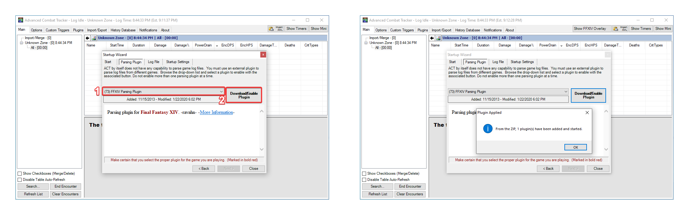

Click **Next** to move to the log file section. ACT will ask if it will be used for Final Fantasy XIV. Select **Yes** to configure ACT logs for FFXIV.

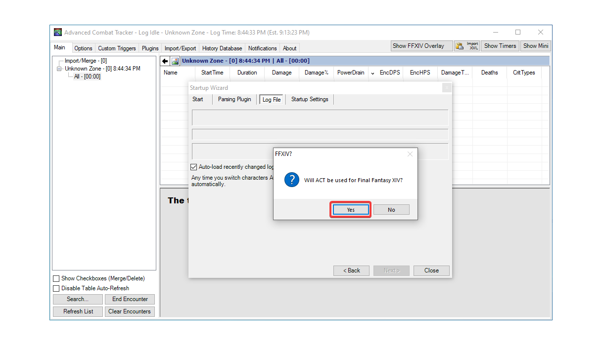

Click **Next** to move to Startup Settings, then **Close** to accept the default settings and finish the startup wizard.

At this point `FFXIV_ACT_Plugin.dll` should be enabled in **Plugins** > **Plugin Listing**.

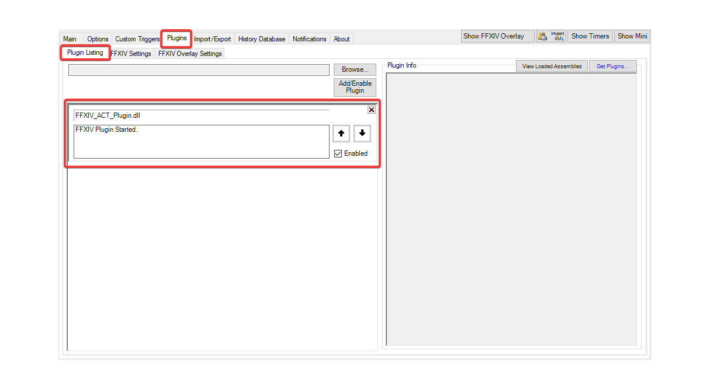
